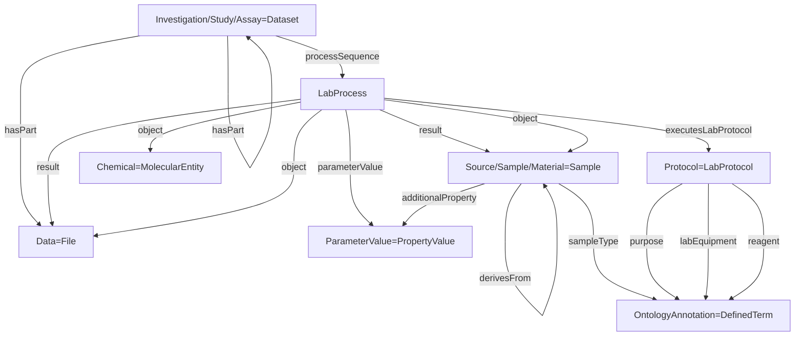

# ISA-Tox RO-Crate Profile

* Version: 0.1.0-draft.1
* Permalink: <https://w3id.org/ro/crate/isa-tox/1.0>
* Profile of: [ISA RO-Crate Profile](isa.md) (<https://w3id.org/ro/crate/isa/1.0>)
* Authors
  * Jente Houweling - https://orcid.org/0009-0005-3680-0645
* **Table of contents**
  * [Overview](#overview)
  * [Conformance](#conformance)
  * [Requirements](#requirements)
    * [MolecularEntity - Chemical](#molecularentity---chemical)
    * [Sample - Cell-based Test System](#sample---cell-based-test-system)
    * [LabProcess - Cell Culture](#labprocess---cell-culture)
    * [LabProcess - Exposure](#labprocess---exposure)
    * [LabProcess - Endpoint Readout](#labprocess---endpoint-readout)
    * [LabProcess - Data Analysis](#labprocess---data-analysis)
  * [Example ro-crate-metadata.json](#example-ro-crate-metadatajson)

## Overview

This profile extends the [ISA](https://isa-tools.org/index.html) [RO-Crate](https://www.researchobject.org/ro-crate/) profile
([ISA RO-Crate Profile](isa.md), originally produced by [NFDI4Plants](https://github.com/nfdi4plants/isa-ro-crate-profile))
with the entity types needed to describe experimental *in vitro* toxicology studies and New Approach Methodologies (NAMs).

It is the domain layer of a three-layer architecture: the base [RO-Crate](https://www.researchobject.org/ro-crate/)
layer provides a portable, self-describing data package on [Schema.org](https://schema.org/); the
[ISA RO-Crate Profile](isa.md) provides the structural Investigation → Study → Assay hierarchy with experimental steps
modelled as [Bioschemas](https://bioschemas.org/) `LabProcess` / `LabProtocol`; and this profile adds the
toxicology-specific, ontology-backed requirements on top.

The extension is additive and reuse-first: each concept is expressed through the most specific applicable
[Schema.org](https://schema.org/) or [Bioschemas](https://bioschemas.org/) type, refined where necessary by a fixed
`additionalType` discriminator (the same pattern the ISA profile uses for its
[PropertyValue](isa.md#propertyvalue) subtypes). Test/control chemicals are
[bioschemas.org/MolecularEntity](https://bioschemas.org/MolecularEntity) instances; the cell-based test system is a
[Sample](isa.md#sample) carrying `sampleType` and a Cellosaurus `identifier`; and the experimental workflow is a chain of
[LabProcess](isa.md#labprocess) steps discriminated as `CellCulture`, `Exposure`, `EndpointReadout`, and `DataAnalysis`.
No new RDF types are introduced, and no change to the base RO-Crate specification or the ISA profile is required.

Requirement levels use [RFC 2119](https://tools.ietf.org/html/rfc2119) keywords, as recommended by the RO-Crate 1.2
profile conventions: MUST (required for conformance), SHOULD (recommended; absence is reported as a warning), and
MAY (optional). 
The following graph summarises the *in vitro* toxicology workflow in terms of the profile's entity types.



> **How the reference builder encodes this.** The tables below give the canonical
> property names and expected types (what the SHACL shapes check). The
> `rocrate-wizard` builder emits them through compact JSON-LD aliases defined in
> the crate's `@context`, all RDF-identical to the canonical predicates:
>
> - `@type` is the bare token (`Sample`, `LabProcess`, `LabProtocol`,
>   `PropertyValue`, …); the `@context` expands it to the Bioschemas/schema.org
>   IRI named in the tables.
> - process parameters appear under `parameter` (→ `schema:additionalProperty`),
>   inputs under `input` (→ `schema:object`), outputs under `output`
>   (→ `schema:result`), and `derivesFrom` expands to `schema:isBasedOn`.
> - each `parameter` is a `PropertyValue` **node** with a deterministic `@id`, a
>   `propertyID` IRI and optional `unitText` — never an inline literal (the
>   LabProcess shapes use `sh:class schema:PropertyValue`).
> - each `Sample`'s `derivesFrom` links the source `ChemicalSubstance` /
>   `BioChemEntity` contextual entity; the MUST shape enforces only `minCount 1`.
>
> The three LabProcess shapes are **selected by `additionalType`** (`CellCulture`
> / `Exposure` / `EndpointReadout`): a generic `LabProcess` with no
> `additionalType` is targeted by no tox shape and is checked only by the base +
> ISA layers. The ISA-Tox pass runs at `OPTIONAL` severity, so a missing tox MUST
> is reported but does not fail the CLI exit code (which tracks the base pass).

## Conformance

A crate following this profile declares conformance using the **RO-Crate 1.2** convention: the
*RO-Crate Metadata Descriptor*'s `conformsTo` carries only the single base-specification URI, while the
profile URIs the crate targets are declared on the **Root Data Entity** (`./`). Each referenced profile is
also declared as a `Profile` contextual entity.

```json
{
  "@id": "ro-crate-metadata.json",
  "@type": "CreativeWork",
  "conformsTo": {"@id": "https://w3id.org/ro/crate/1.2"},
  "about": {"@id": "./"}
}
```

The Root Data Entity declares the targeted profiles:

```json
{
  "@id": "./",
  "@type": "Dataset",
  "conformsTo": [
    {"@id": "https://github.com/nfdi4plants/isa-ro-crate-profile"},
    {"@id": "https://w3id.org/ro/crate/isa-tox/1.0"}
  ]
}
```

The ISA layer is declared with the IRI the profile actually extends (see
`profiles/shapes/tox/profile.ttl`, `prof:isProfileOf`); a stable `w3id.org/ro/crate/isa/…`
permalink is not yet registered. The referenced profiles are declared as contextual entities:

```json
{
  "@id": "https://github.com/nfdi4plants/isa-ro-crate-profile",
  "@type": ["CreativeWork", "Profile"],
  "name": "ISA RO-Crate Profile"
},
{
  "@id": "https://w3id.org/ro/crate/isa-tox/1.0",
  "@type": ["CreativeWork", "Profile"],
  "name": "ISA-Tox RO-Crate Profile",
  "version": "0.1.0-draft.1"
}
```

> **Note — RO-Crate 1.2 placement.** RO-Crate **1.2** recommends declaring the profiles a crate targets on the
> *Root Data Entity* (`./`) and reserving the *Metadata Descriptor*'s `conformsTo` for a single base-specification
> value — which this profile now follows (Issue #110). The earlier 1.1 placement (all URIs on the descriptor) was a
> temporary measure while the toolchain lagged: it was lifted once `rocrate-validator` 0.11.0 shipped a `ro-crate-1.2`
> base profile (crs4/rocrate-validator#164), so the base pass validates against 1.2.

A machine-readable [Profile Crate](https://www.researchobject.org/ro-crate/specification/1.2/profiles.html#profile-crate) bundling this
description with the SHACL shapes MAY additionally be published at the profile URI; this is planned but not yet provided.

## Requirements

### MolecularEntity - Chemical

The test and control chemicals are modelled as [bioschemas.org/MolecularEntity](https://bioschemas.org/MolecularEntity)
instances (rather than the broader `ChemicalSubstance`), so a resolvable identifier and structure make the compound
machine-actionable. Concentration is **not** a property of the compound — it is carried per well by the
[Exposure](#labprocess---exposure)'s condition table (CSVW), so there is no per-concentration chemical Sample.

| Property | Required | Expected Type | Description |
|----------|----------|---------------|-------------|
|@id|MUST|Text or URL|A resolvable compound IRI where possible, e.g. a [PubChem](https://pubchem.ncbi.nlm.nih.gov/) or CompoundWiki entry.|
|@type|MUST|Text|MUST be '[bioschemas.org/MolecularEntity](https://bioschemas.org/MolecularEntity)'|
|name|MUST|Text|The compound name.|
|identifier|SHOULD|Text, URL or [schema.org/PropertyValue](isa.md#propertyvalue)|A compound identifier (e.g. InChIKey, CAS, PubChem CID), ideally a PropertyValue carrying its scheme, resolving to an authoritative resource.|
|inChIKey|SHOULD|Text|The hashed InChI for unambiguous structure lookup.|
|smiles|SHOULD|Text|The compound structure as SMILES.|
|inChI|MAY|Text|The compound structure as InChI.|
|molecularFormula|MAY|Text|The molecular formula.|
|url|MAY|URL|Link to an external record, e.g. PubChem, ChEBI or CompoundWiki.|

### Sample - Cell-based Test System

Is based on the Bioschemas [bioschemas.org/Sample](https://bioschemas.org/Sample) type ([ISA Sample](isa.md#sample)).
The cell-based test system (e.g. a cell line) is a single Sample carrying a categorical annotation via `sampleType`
(a [DefinedTerm](isa.md#definedterm)) and a cell-line identity via `identifier` resolved to a Cellosaurus accession.
It is discriminated by `additionalType` `"CellLine"` so intermediate, derived Samples (cultured / exposed cells) are not
constrained by this shape.

| Property | Required | Expected Type | Description |
|----------|----------|---------------|-------------|
|@id|MUST|Text or URL|Could be the unique sample name, e.g. the cell-line name.|
|@type|MUST|Text|MUST be '[bioschemas.org/Sample](https://bioschemas.org/Sample)'|
|additionalType|MUST|Text|MUST be `"CellLine"`. Discriminator identifying this Sample as the cell-based test system.|
|sampleType|MUST|[schema.org/DefinedTerm](isa.md#definedterm)|A categorical annotation of the test system as a fixed, resolvable ontology term (its `@id` dereferences to the term), e.g. "cell line" → [NCIT:C16403](http://purl.obolibrary.org/obo/NCIT_C16403).|
|name|MUST|Text|A name identifying the sample, e.g. the cell-line name.|
|identifier|SHOULD|Text, URL or [schema.org/PropertyValue](isa.md#propertyvalue)|The cell-line identity resolved to a [Cellosaurus](https://www.cellosaurus.org/) accession (e.g. `CVCL_0027`).|
|additionalProperty|SHOULD|[schema.org/PropertyValue](isa.md#propertyvalue) ([Characteristic](isa.md#propertyvalue---characteristic))|Characteristics of the sample, e.g. passage number or growth conditions.|
|url|MAY|URL|Link to the [Cellosaurus](https://www.cellosaurus.org/) entry.|

### LabProcess - Cell Culture

Is based on the Bioschemas DRAFT [bioschemas.org/LabProcess](https://bioschemas.org/LabProcess) type
([ISA LabProcess](isa.md#labprocess)), narrowed by `additionalType` to represent maintenance of the biological model in
culture.

| Property | Required | Expected Type | Description |
|----------|----------|---------------|-------------|
|@id|MUST|Text or URL|Could identify the process using the process name and protocol reference.|
|@type|MUST|Text|MUST be '[bioschemas.org/LabProcess](https://bioschemas.org/LabProcess)'|
|additionalType|MUST|Text|MUST be `"CellCulture"`. Discriminator identifying this LabProcess as a cell-culture step.|
|name|MUST|Text|The name of the process, e.g. "Cell Culture".|
|object|MUST|[bioschemas.org/Sample](isa.md#sample)|The input cell-line sample(s). At least one.|
|result|MUST|[bioschemas.org/Sample](isa.md#sample)|The output (cultured) sample(s). At least one.|
|parameterValue|MUST|[schema.org/PropertyValue](isa.md#propertyvalue) ([Parameter](isa.md#propertyvalue---parameter))|Process parameter(s); see expected values below. At least one.|
|executesLabProtocol|SHOULD|[bioschemas.org/LabProtocol](isa.md#labprotocol)|The protocol this step executes.|

**Expected `parameterValue` items.** Each is a Parameter [PropertyValue](isa.md#propertyvalue---parameter)
(`additionalType` `"ParameterValue"`). The profile requires at least one `parameterValue`; the following are recommended
for this step:

| name | Required | propertyID |
|------|----------|------------|
|Culture Medium|SHOULD|`http://www.bioassayontology.org/bao#BAO_0000114`|

### LabProcess - Exposure

Is based on the Bioschemas DRAFT [bioschemas.org/LabProcess](https://bioschemas.org/LabProcess) type
([ISA LabProcess](isa.md#labprocess)), narrowed by `additionalType` to represent exposing the cell-based test system to
the chemical(s). It captures the experimental design: it takes the cultured cell [Sample](isa.md#sample)
as its `object`, and emits a normalised condition table (CSVW) as its `result` in which each row records a single
well (cell line, compound, concentration, exposure duration).

> **Where the compound goes.** The [MolecularEntity](#molecularentity---chemical) compound is **not** a process
> `object`: the inherited ISA [LabProcess](isa.md#labprocess) shape restricts `schema:object` (and `schema:result`)
> to `File`/`Sample`/`BioSample`, so a `MolecularEntity` there fails validation. The compound is instead connected
> **through the condition table** — the table's compound column resolves (CSVW `valueUrl`) to the `MolecularEntity`
> `@id`, and the compound is also listed at a glance on the [Study](#) via `schema:mentions`.

| Property | Required | Expected Type | Description |
|----------|----------|---------------|-------------|
|@id|MUST|Text or URL|Could identify the process using the process name and protocol reference.|
|@type|MUST|Text|MUST be '[bioschemas.org/LabProcess](https://bioschemas.org/LabProcess)'|
|additionalType|MUST|Text|MUST be `"Exposure"`. Discriminator identifying this LabProcess as an exposure step.|
|name|MUST|Text|The name of the process, e.g. "Exposure".|
|object|MUST|[bioschemas.org/Sample](isa.md#sample) or [File](https://schema.org/MediaObject)|The input cell sample(s) being exposed. At least one. (A `MolecularEntity` is **not** allowed here — see note above.)|
|parameterValue|MUST|[schema.org/PropertyValue](isa.md#propertyvalue) ([Parameter](isa.md#propertyvalue---parameter))|Exposure parameter(s); see expected values below. At least one.|
|result|MUST|[bioschemas.org/Sample](isa.md#sample) or [File](https://schema.org/MediaObject) (typed also as `csvw:Table`)|The exposed sample(s), and — once populated — the CSVW condition table whose rows name the sample each well produced. At least one.|
|executesLabProtocol|SHOULD|[bioschemas.org/LabProtocol](isa.md#labprotocol)|The protocol(s) this step executes: the procedural SOP, and the per-well condition table supplying the plate layout the SOP leaves out.|

**Expected `parameterValue` items.** Each is a Parameter [PropertyValue](isa.md#propertyvalue---parameter)
(`additionalType` `"ParameterValue"`). The profile requires at least one `parameterValue`; the following are recommended
for this step:

| name | Required | propertyID |
|------|----------|------------|
|Exposure Duration|SHOULD|`http://purl.obolibrary.org/obo/NCIT_C83280`|
|Cell Seeding Density|SHOULD|`http://purl.obolibrary.org/obo/MSIO_0000062`|
|Microplate|SHOULD|`http://purl.obolibrary.org/obo/NCIT_C43377`|

### LabProcess - Endpoint Readout

Is based on the Bioschemas DRAFT [bioschemas.org/LabProcess](https://bioschemas.org/LabProcess) type
([ISA LabProcess](isa.md#labprocess)), narrowed by `additionalType` to represent measurement of the assay endpoint.

| Property | Required | Expected Type | Description |
|----------|----------|---------------|-------------|
|@id|MUST|Text or URL|Could identify the process using the process name and protocol reference.|
|@type|MUST|Text|MUST be '[bioschemas.org/LabProcess](https://bioschemas.org/LabProcess)'|
|additionalType|MUST|Text|MUST be `"EndpointReadout"`. Discriminator identifying this LabProcess as a measurement readout.|
|name|MUST|Text|The name of the process, e.g. "Endpoint Readout".|
|result|MUST|[File](https://schema.org/MediaObject)|The output data file(s). At least one.|
|parameterValue|MUST|[schema.org/PropertyValue](isa.md#propertyvalue) ([Parameter](isa.md#propertyvalue---parameter))|Measurement parameter(s); see expected values below. At least one.|
|object|SHOULD|[bioschemas.org/Sample](isa.md#sample) or [File](https://schema.org/MediaObject)|The input entities being measured.|
|executesLabProtocol|SHOULD|[bioschemas.org/LabProtocol](isa.md#labprotocol)|The protocol this step executes.|

**Expected `parameterValue` items.** Each is a Parameter [PropertyValue](isa.md#propertyvalue---parameter)
(`additionalType` `"ParameterValue"`). The profile requires at least one `parameterValue`; the following are recommended
for this step:

| name | Required | propertyID |
|------|----------|------------|
|Detection Instrument|SHOULD|`http://www.bioassayontology.org/bao#BAO_0000697`|
|Instrument Manufacturer|SHOULD|`http://www.bioassayontology.org/bao#BAO_0002628`|
|Measured Entity|SHOULD|`http://www.bioassayontology.org/bao#BAO_0002001`|
|Technical replicate|SHOULD|`http://www.ebi.ac.uk/efo/EFO_0002090`|
|Endpoint|SHOULD|`http://www.bioassayontology.org/bao#BAO_0000179`|
|Assay Kit|MAY|`http://www.bioassayontology.org/bao#BAO_0000248`|
|Substrate|MAY|`http://www.bioassayontology.org/bao#BAO_0003063`|

> **Note.** The `propertyID` IRIs above record exactly what the reference builder emits and are not yet normalised to a
> single resolver; their curation and the mechanism that scores these parameters against the OECD / community reporting
> standards are described in [`../mit/docs/MIT_METADATA_WIRING.md`](../mit/docs/MIT_METADATA_WIRING.md).

### LabProcess - Data Analysis

Is based on the Bioschemas DRAFT [bioschemas.org/LabProcess](https://bioschemas.org/LabProcess) type
([ISA LabProcess](isa.md#labprocess)), narrowed by `additionalType` to represent the processing pipeline that turns the
raw endpoint measurements into the reported results. It consumes the [Endpoint Readout](#labprocess---endpoint-readout)'s
raw-data File(s) and emits the processed-data File(s) along the derivation graph. It corresponds to the *Analysis and
Statistics* module of the Minimum Information Table.

| Property | Required | Expected Type | Description |
|----------|----------|---------------|-------------|
|@id|MUST|Text or URL|Could identify the process using the process name and protocol reference.|
|@type|MUST|Text|MUST be '[bioschemas.org/LabProcess](https://bioschemas.org/LabProcess)'|
|additionalType|MUST|Text|MUST be `"DataAnalysis"`. Discriminator identifying this LabProcess as a data-analysis step.|
|name|MUST|Text|The name of the process, e.g. "Data Analysis".|
|object|MUST|[File](https://schema.org/MediaObject) or [bioschemas.org/Sample](isa.md#sample)|The raw-data input(s) being analysed. At least one.|
|result|MUST|[File](https://schema.org/MediaObject)|The processed-data output file(s). At least one.|
|parameterValue|MUST|[schema.org/PropertyValue](isa.md#propertyvalue) ([Parameter](isa.md#propertyvalue---parameter))|Analysis parameter(s); see expected values below. At least one.|
|executesLabProtocol|SHOULD|[bioschemas.org/LabProtocol](isa.md#labprotocol)|The protocol this step executes.|

**Expected `parameterValue` items.** Each is a Parameter [PropertyValue](isa.md#propertyvalue---parameter)
(`additionalType` `"ParameterValue"`). The profile requires at least one `parameterValue`; the following are recommended
for this step (drawn from OHT 201's *Data & Analysis* module):

| name | Required |
|------|----------|
|Data Calculation and Statistics|SHOULD|
|Computational Tool|SHOULD|
|Acceptance Criteria|MAY|
|Evaluation Criteria|MAY|

## Example ro-crate-metadata.json

A worked example crate is available at
[`examples/export/S-VHPS16_rocrate/ro-crate-metadata.json`](../../examples/export/S-VHPS16_rocrate/ro-crate-metadata.json).
Its LabProcess entities carry the `CellCulture` / `Exposure` / `EndpointReadout`
`additionalType` discriminators described above, and it validates green across
all three passes (base RO-Crate 1.1 → ISA → ISA-Tox) at REQUIRED severity.
